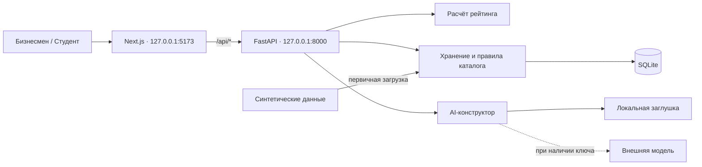

# Alem — практические задачи бизнеса

Локальный MVP для кейса HackAlem / AI Sana: бизнес составляет карточку задачи, подтверждает сведения и публикует её в каталоге. Студенты просматривают все опубликованные задачи и сохраняют интересные. Готовность описания определяет рейтинг и порядок в каталоге.

**Реализована первая часть.** Работают создание, редактирование, подтверждение и публикация карточек, рейтинг, каталог с фильтрами, тестовые профили и рекомендации-квесты по навыкам. Добавлен AI-конструктор: уточняющие вопросы, карточка с источниками и явный перенос в форму. Без ключа внешнего API работает обозначенный локальный резервный режим. Полноценная отправка откликов команд и ручной выбор исполнителей бизнесом ещё не реализованы. Сохранение квеста выражает интерес студента и никого не назначает на задачу.

## Быстрый запуск

Проверенное окружение: **macOS, Python 3.13.9, Node.js 25.8.0**. Приложение требует Python 3.11+, а frontend объявляет Node.js 22.13.0+. Другие версии и ОС не проверены этим прогоном. Нужны `python3`, `node` и `npm` в `PATH`; первоначальная установка использует интернет. Общий скрипт запуска рассчитан на macOS/Linux.

В корне репозитория:

```sh
python3 scripts/setup.py
python3 scripts/dev.py
```

Установка создаёт `backend/.venv`, устанавливает версии из `backend/requirements.txt` и запускает `npm ci` по `frontend/package-lock.json`. Глобальные Python-пакеты не меняются. Для повторной установки используется та же команда; перед её выполнением остановите свои запущенные сервисы.

После сообщения `Ready` откройте [приложение](http://127.0.0.1:5173). Документация API доступна по адресу [127.0.0.1:8000/docs](http://127.0.0.1:8000/docs), проверка сервера — [127.0.0.1:8000/api/health](http://127.0.0.1:8000/api/health).

`Ctrl-C` останавливает оба сервиса и их дочерние процессы. Если один сервис завершится, скрипт остановит второй. При занятых портах `8000` или `5173` запуск отменяется: чужие процессы не завершаются. Скрипт не выполняет публичное развёртывание.

Проверки без установки и запуска:

```sh
python3 scripts/setup.py --check
python3 scripts/dev.py --check
```

Первая проверяет инструменты и файлы зависимостей; вторая — установленное окружение и свободные порты. Если приложение уже запущено, вторая проверка ожидаемо сообщит о занятых портах.

## Запуск отдельно и проверка сборки

Можно открыть два терминала в корне проекта. В первом:

```sh
backend/.venv/bin/python -m uvicorn app.main:app --app-dir backend --host 127.0.0.1 --port 8000
```

Во втором:

```sh
npm --prefix frontend run dev
```

Next.js принимает запросы `/api/*` и перенаправляет их на FastAPI по адресу `http://127.0.0.1:8000`. Интерфейс и API слушают только локальный адрес `127.0.0.1`.

Для локального запуска собранного приложения сначала остановите текущий запуск, затем выполните:

```sh
npm --prefix frontend run build
python3 scripts/dev.py --production
```

Для отдельного запуска собранного frontend предусмотрен `npm --prefix frontend run start`; FastAPI должен быть запущен во втором терминале. После изменений backend общий скрипт нужно перезапустить; автоматическая перезагрузка Uvicorn в нём не включена.

### Настройки окружения

Приложение читает переменные окружения процесса. Файл [.env.example](.env.example) служит справкой; копирование его в `.env` само по себе ничего не подключает.

| Переменная | По умолчанию | Назначение |
| --- | --- | --- |
| `APP_DB_PATH` | `backend/data/hackalem.sqlite3` | Путь к SQLite; для другой базы рекомендуется абсолютный путь |
| `OPENAI_API_KEY` | Не задана | Необязательный серверный ключ; без него AI работает в явно обозначенном резервном режиме |
| `OPENAI_MODEL` | `gpt-4.1-mini` | Модель для внешнего AI-адаптера |
| `BACKEND_URL` | `http://127.0.0.1:8000` | Адрес API для Next.js при отдельном запуске; общий скрипт всегда устанавливает локальный адрес |

Для production-сборки frontend задавайте нужный `BACKEND_URL` **до** `npm run build`: маршруты перенаправления входят в сборку. Настройка AI описана в [docs/AI.md](docs/AI.md). Ключ остаётся на сервере и не включается в frontend или Git.

## Архитектура

Приложение состоит из двух локальных процессов и SQLite-файла. Backend — Python / FastAPI / Pydantic; frontend — TypeScript / Next.js 16 / React 19 / Tailwind CSS 4. Установленные версии фиксируются в [requirements.txt](backend/requirements.txt) и [package-lock.json](frontend/package-lock.json).



| Компонент | Ответственность |
| --- | --- |
| [frontend/app/page.tsx](frontend/app/page.tsx) | Каталог, фильтры, тестовые роли и профили, сохранённые задачи и окна квестов |
| [frontend/components/tasks](frontend/components/tasks) | Редактор из четырёх шагов, разбивка баллов, просмотр карточки, AI-помощник с источниками |
| [frontend/lib/api.ts](frontend/lib/api.ts) | HTTP-клиент, заголовок тестовой роли, обработка ошибок и тайм-аут запросов |
| [backend/app/main.py](backend/app/main.py), [models.py](backend/app/models.py) | Маршруты API, проверка типов, размеров и допустимых полей, проверка тестовой роли |
| [backend/app/domain.py](backend/app/domain.py) | Единственная формула рейтинга для предварительной и подтверждённой оценки; без вызовов AI |
| [backend/app/store.py](backend/app/store.py) | Транзакции SQLite, версии карточек, сортировка, подбор квестов и решения студентов |
| [backend/app/seed.py](backend/app/seed.py) | Повторяемый импорт исходного набора без дублирования записей |
| [backend/app/ai.py](backend/app/ai.py) | Уточняющие вопросы, подготовка неподтверждённых полей, проверка источников и резервный режим |

В таблице `tasks` хранятся текущий черновик (`draft_json`) и последний опубликованный снимок (`published_json`). `profiles` содержит тестовые профили студентов; `quest_decisions` — сохранение или пропуск задачи для конкретного профиля. `fixture_records` сохраняет исходные записи набора, `metadata` — версию начального наполнения. Запросы к SQLite параметризованы. AI-модуль не записывает данные в эти таблицы.

Основные маршруты:

| Маршрут | Назначение |
| --- | --- |
| `GET /api/tasks` | Опубликованные карточки; фильтры `q`, `topic`, `readiness` |
| `GET /api/tasks?view=business` | Текущие версии карточек тестового бизнеса, включая неопубликованные |
| `POST /api/tasks`, `PUT /api/tasks/{id}` | Создать или сохранить черновик |
| `POST /api/tasks/{id}/confirm`, `POST /api/tasks/{id}/publish` | Подтвердить текущую версию, затем опубликовать её |
| `POST /api/rating/preview` | Рассчитать потенциальные баллы без сохранения и подтверждения |
| `GET /api/profiles`, `PUT /api/profiles/{id}/skills` | Получить профили и изменить навыки |
| `GET /api/quests?profileId={id}` | Получить до трёх рекомендаций |
| `POST /api/quests/{id}/decision`, `GET /api/saved?profileId={id}` | Сохранить/пропустить задачу, получить сохранённые |
| `POST /api/ai/analyze`, `POST /api/ai/build-card` | Получить вопросы и предварительную карточку с источниками |
| `GET /api/demo-data` | Исходный синтетический набор и соответствие идентификаторов |

Форматы запросов доступны в [Swagger UI](http://127.0.0.1:8000/docs) запущенного сервера. Работа с черновиками и AI требует `X-Demo-Role: business`; изменение навыков и решения по квестам — `X-Demo-Role: student`. Это демонстрационные ограничения, а не авторизация пользователей.

## Данные и тестовые роли

Первый запуск создаёт SQLite-базу `backend/data/hackalem.sqlite3` и синтетические данные: **5 опубликованных задач**, **5 неопубликованных черновиков** и **5 профилей**. Рейтинги опубликованных примеров из пользовательского набора: 100, 90, 75, 50 и 20. Первый профиль имеет навыки Python, SQL и «Аналитика». При обычном повторном запуске данные сохраняются, примеры не дублируются.

Другую базу можно указать переменной окружения. Например, для отдельной демонстрации, сохранив рабочую базу:

```sh
APP_DB_PATH=/tmp/hackalem-demo.sqlite3 python3 scripts/dev.py
```

Если файла ещё нет, в нём появятся стартовые примеры. Если он уже существует, приложение продолжит работу с его данными. Базы, виртуальное окружение, `node_modules`, секреты и результаты сборки исключены через `.gitignore` и не должны попадать в коммиты.

Переключатели «Бизнесмен» и «Студент» — **тестовые роли, а не регистрация и аутентификация**. API проверяет заголовок `X-Demo-Role` для изменения данных, но любой клиент может его передать. Этот режим предназначен для локальной демонстрации с синтетическими данными. CORS также не заменяет аутентификацию.

Выбор текущей роли и профиля хранится только в состоянии страницы. После перезагрузки снова выберите нужные роль и профиль; сохранённые в базе карточки, навыки и решения при этом остаются.

## Формула рейтинга задачи

Главная геймификация направлена на бизнес: полнота **подтверждённого описания конкретной задачи** повышает её рейтинг и позицию в каталоге. Известность компании и количество сохранений на баллы не влияют. Реализованная оценка проверяет заполненность полей; она не доказывает достоверность сведений или качество решения.

| Показатель | Поля API | Максимум |
| --- | --- | ---: |
| Контекст и потребность | `context` — 10, `need` — 10 | 20 |
| Данные и материалы | `data` | 20 |
| Ожидаемый результат | `expectedResult` | 15 |
| Критерии успеха | `successCriteria` | 15 |
| Ограничения | `constraints` | 10 |
| Пользователи | `users` | 10 |
| Связь с бизнесом | `contact` — 5, `interactionFormat` — 5 | 10 |
| **Всего** | | **100** |

Для каждого поля `f` задаются вес `w(f)` и индикатор `c(f)`:

```text
c(f) = 1, если текущая версия подтверждена,
          поле заполнено содержимым, отличным от явной заглушки,
          и поле входит в confirmedFields, когда этот список задан;
       0 — иначе.

R = Σ w(f) × c(f),  0 ≤ R ≤ 100

R = 10·c(context) + 10·c(need) + 20·c(data)
  + 15·c(expectedResult) + 15·c(successCriteria)
  + 10·c(constraints) + 10·c(users)
  + 5·c(contact) + 5·c(interactionFormat)
```

Поле получает весь свой вес или ноль. Например, только контекст даёт 10 из 20 баллов группы «Контекст и потребность». Название, компания, направление, навыки и отдельное поле `feedbackProcess` («Дополнительные договорённости») баллов не дают. Для связи с бизнесом оцениваются контакт и поле «Консультации и обратная связь».

Пустые строки, строки только из пунктуации и точные заглушки `уточнить`, `неизвестно`, `tbd`, `todo`, `n/a`, `пока неизвестно`, `будет уточнено` не засчитываются. При проверке нормализуются регистр, пробелы и пунктуация по краям. Произвольные фразы вроде «данные предоставим позднее» автоматически не оцениваются по смыслу — это ограничение текущей формулы.

**Предварительная оценка** рассчитывается по заполнению формы так, как если бы её подтвердили. Она помогает увидеть возможный результат, но не начисляет баллы и не меняет каталог. У сохранённого неподтверждённого черновика рейтинг равен 0. При импорте учитывается список `confirmed_fields` из исходного набора.

| Баллы | Уровень API | Значение в интерфейсе и каталоге |
| --- | --- | --- |
| 0–39 | `draft` | Нужно уточнить; опубликованная задача доступна студентам |
| 40–69 | `workable` | Рабочая; может попасть в рекомендации при совпадении профиля |
| 70–89 | `ready` | Готовая; располагается выше задач с меньшим рейтингом |
| 90–100 | `priority` | Приоритетная; дополнительно выделяется оформлением |

Название уровня `draft` характеризует готовность описания, а не факт публикации. Например, опубликованная задача с 20 баллами видна всем. Уровень от 90 баллов также не означает, что заполнено абсолютно каждое поле: все веса набираются только при 100 баллах.

### Подтверждение и публикация

1. Бизнес заполняет форму и сохраняет черновик. Каждое сохранение существующей карточки через `PUT` создаёт новую ревизию и сбрасывает подтверждение всей текущей версии, даже если значения совпали.
2. На последнем шаге бизнес проверяет сведения и ставит отметку «Я проверил(а) сведения в карточке». Одна отметка ничего не отправляет на сервер.
3. Кнопка «Опубликовать задачу» или «Обновить публикацию» последовательно сохраняет форму, подтверждает текущую версию и публикует её. Для публикации нужны подтверждение и непустое название; минимального рейтинга нет.
4. Каталог получает новый снимок и пересортировывается. После следующих правок старые опубликованные поля и баллы остаются видимыми до нового подтверждения **и** публикации.

Так можно безопасно дорабатывать уже опубликованную задачу: текущий черновик бизнеса и видимая студентам версия могут иметь разные тексты и оценки.

## Правила каталога и квестов

### Общий каталог

- Видны все опубликованные снимки, включая задачи с рейтингом 0–39. Неопубликованные черновики доступны только в тестовом режиме бизнеса.
- Порядок: **рейтинг по убыванию**, при одинаковом рейтинге — внутренний UUID по возрастанию. Дата публикации, название компании и число сохранений порядок не меняют.
- В интерфейсе есть фильтры по направлению (`topic`) и уровню готовности. Поиск без учёта регистра проверяет название, компанию, потребность и требуемые навыки. Фильтрация выполняется в браузере и сохраняет серверный порядок.
- API также поддерживает фильтры `q`, `topic`, `readiness`. Его поиск `q` шире интерфейсного: все текстовые поля карточки, компания, тема и навыки. Отрасль не входит в поиск. Сервер обрезает пробелы поисковой строки и сравнивает тему без учёта регистра; UI выбирает точную тему из списка.
- Студент может открыть и сохранить любую опубликованную задачу независимо от рейтинга и совпадения навыков. Фильтры пользователь выбирает сам; рекомендации не сокращают общий каталог.

### Персональные квесты

Рекомендации вычисляются обычными правилами, без обращения к внешней модели:

1. Берутся опубликованные задачи с рейтингом **от 40**, которые этот профиль ещё не сохранил и не пропустил.
2. Если `requiredSkills` заполнен, **все** требуемые навыки должны присутствовать в профиле. Сравнение не учитывает регистр; совпадение интереса не отменяет отсутствующий обязательный навык.
3. Если навыки задачи не указаны, нужен интерес профиля, точно совпавший без учёта регистра с темой или отраслью задачи. В исходных пяти карточках навыки отсутствуют, поэтому для них действует именно это правило.
4. API возвращает первые три подходящие задачи в порядке общего каталога. Интерфейс показывает одно окно за раз с причиной рекомендации — навыками или интересом.

«Сохранить квест» добавляет задачу в «Мои квесты»; «Пропустить» сохраняет отказ от рекомендации. Оба решения хранятся в SQLite отдельно для каждого профиля и исключают повторную рекомендацию этой задачи. Крестик только закрывает окно: после перезагрузки страницы такой квест может появиться снова. В течение текущей страницы повторный показ уже увиденного окна также подавляется.

Для подбора используются только навыки и интересы; имя, курс и личные или чувствительные признаки не учитываются. Сохранение выражает интерес, **не является полноценным откликом команды и не назначает исполнителя**. Рабочий процесс откликов и ручного выбора команды бизнесом относится к следующей части MVP.

## Исходный набор и AI-конструктор

В `fixtures/hackalem_synthetic_data.json` и `fixtures/README_hackalem.md` находятся точные копии присланных файлов: 5 черновиков, 5 карточек, 5 команд и 5 откликов. Все 20 записей импортируются в таблицу `fixture_records`; карточки и черновики также доступны через текущий интерфейс. Команды и отклики пока доступны как исходные записи через `GET /api/demo-data`, их рабочий интерфейс будет следующим этапом. Пять индивидуальных тестовых профилей `/api/profiles` — отдельные демонстрационные профили, не подмена пяти команд из набора.

Внутренние UUID карточек/черновиков получаются стабильно из исходных ID; поля `sourceId`/`sourceDraftId` и `apiIds` в `/api/demo-data` сохраняют связь с оригиналом. `null` преобразуется в пустое поле формы и не даёт баллов. Импорт использует `confirmed_fields` и самостоятельно пересчитывает рейтинг. CSV, упомянутые в описаниях, не входят в исходный набор и не выдаются за существующие файлы.

При обновлении базы с начальных примеров до версии 2 добавляются присланные записи; прежние карточки, правки и сохранения сохраняются. Поэтому в ранее запущенной базе записей может быть больше, чем в чистой установке. Формула рейтинга обновляется без изменения текстов.

В конструкторе задачи откройте AI-помощника, введите исходное описание, получите вопросы и ответьте на них. Проверьте предварительную карточку и цитаты-источники, затем нажмите «Перенести в карточку». Перенос не сохраняет, не подтверждает и не публикует задачу: это отдельные действия бизнеса.

Настройка внешней модели, точный промпт, форматы API, проверки ответов и резервный режим описаны в [docs/AI.md](docs/AI.md). Ключ задаётся только на сервере через `OPENAI_API_KEY`; без него приложение полностью запускается локально. Сам API-ключ не требуется для демонстрации формы и резервного сценария.

## Тестовые сценарии

Для воспроизводимой демонстрации остановите свой текущий запуск и укажите **новый, ещё не существующий** путь `APP_DB_PATH`, как в разделе «Данные и тестовые роли». Это создаст отдельную базу без удаления рабочей. Для проверки позиций очищайте поиск и фильтры. Описанные ниже результаты — критерии проверки; история уже выполненных прогонов приведена в [docs/PART1_VERIFICATION.md](docs/PART1_VERIFICATION.md).

### 1. Начальное наполнение и порядок

Откройте каталог на новой базе. Ожидаются пять опубликованных карточек в таком порядке:

| Исходный ID | Название | Баллы | Уровень |
| --- | --- | ---: | --- |
| `task_005` | Панель контроля статусов доставки | 100 | Приоритетная |
| `task_004` | Контроль минимальных остатков товара | 90 | Приоритетная |
| `task_003` | Журнал посещаемости и отчёт по учебным группам | 75 | Готовая |
| `task_002` | Расписание записи в автосервис | 50 | Рабочая |
| `task_001` | Единый список предзаказов для пекарни | 20 | Нужно уточнить |

В режиме бизнеса дополнительно доступны пять неопубликованных черновиков. В `/api/demo-data` — пять исходных черновиков, пять карточек, пять команд и пять откликов; команды и отклики не выдаются за работающий процесс подачи заявок.

### 2. Рост рейтинга и перемещение в каталоге

1. В роли «Бизнесмен» создайте задачу «Тест: список заказов». Заполните только контекст: «Заказы записываем в тетрадь» и потребность: «Нужен единый список заказов». Остальные оцениваемые поля оставьте пустыми. Предварительная оценка — **20**.
2. Нажмите «Сохранить черновик». В «Моих задачах» начислено **0**, в общем каталоге новой задачи нет.
3. Откройте её снова, перейдите к четвёртому шагу, проверьте сведения, поставьте отметку и опубликуйте. В каталоге рейтинг **20**; задача находится ниже автосервиса с **50**. Порядок между двумя задачами с 20 определяется UUID.
4. Добавьте данные: «Есть тестовая таблица из 30 заказов» и ожидаемый результат: «Веб-список заказов с поиском». Предварительная оценка — **55**: `10 + 10 + 20 + 15`. Сохраните черновик. В каталоге по-прежнему **20** и старые поля; текущая версия бизнеса не подтверждена.
5. Снова откройте редактор, подтвердите сведения и нажмите «Обновить публикацию». Теперь рейтинг **55**: задача выше автосервиса с **50**, но ниже журнала посещаемости с **75**.
6. Для проверки защиты замените данные на `TBD`: предварительная оценка станет **35**. Верните исходный текст или выйдите без сохранения. Изменение только компании, названия или навыков предварительные баллы не увеличивает.

Это основной сценарий демонстрации геймификации бизнеса. Точный номер позиции зависит от других добавленных задач, поэтому сравнивайте относительный порядок и баллы.

### 3. Низкий рейтинг не закрывает каталог

В роли «Студент» найдите пекарню с **20** баллами через поиск или фильтр «Нужно уточнить». Откройте её и нажмите «Сохранить задачу». Она должна появиться в «Моих квестах», хотя для автоматической рекомендации её рейтинг недостаточен. Исполнитель и команда не назначаются. После снятия фильтров снова видны все опубликованные задачи.

### 4. Подбор по навыкам и решение студента

1. У задачи из сценария 2 с рейтингом **55** выберите требуемые навыки **Python** и **SQL**, подтвердите и обновите публикацию. Баллы остаются **55**.
2. В роли студента выберите профиль **Тимур**. На новой базе у него «Дизайн» и Figma: тестовая задача остаётся в общем каталоге, но в рекомендации ему не проходит.
3. В профиле добавьте Python и SQL, нажмите «Сохранить навыки» и перезагрузите страницу, чтобы исключить подавление уже показанных окон. Снова выберите роль «Студент» и профиль «Тимур». На исходном наборе тестовая задача подходит по обоим навыкам и появляется как квест; причина содержит Python и SQL.
4. Нажмите «Сохранить квест», перезагрузите страницу и снова выберите студента Тимура: задача остаётся в «Моих квестах» и больше не рекомендуется этому профилю.
5. Для проверки пропуска выберите профиль **Дана**: на исходном наборе ей подходит журнал посещаемости с **75** баллами по интересу «Образование». Нажмите «Пропустить», перезагрузите страницу и снова выберите Дану. Эта рекомендация не должна вернуться, но задача остаётся в общем каталоге.

Проверять изменение навыков только на исходных пяти карточках недостаточно: у них нет требований к навыкам, и подбор использует интересы. При наличии дополнительных пользовательских задач рекомендация может уступать место более высоким по рейтингу; точный список доступен в `/api/quests?profileId={id}`.

### 5. AI без внешнего API и подтверждение человеком

Запустите backend без `OPENAI_API_KEY`, откройте новую задачу и AI-помощника. Введите «Заказы записываем в тетрадь. Нужен единый список заказов». Запросите вопросы, ответьте на часть из них и соберите карточку.

Ожидаемый результат: явно показан резервный режим; для неполной карточки возвращаются **3–6 вопросов**. В предложении видны источники, ответы перенесены в соответствующие поля, неизвестное остаётся пустым. В локальном режиме исходное описание переносится в контекст, если он был пуст. Если все поля уже заполнены, вопросов может быть ноль — с объяснением.

Проверьте текст и нажмите «Перенести в карточку». Задача ещё не сохранена и не опубликована; без отметки человека публикация недоступна. После ручной проверки выполните обычное сохранение или публикацию. Ввод помощнику, который не перенесён в форму, не сохраняется вместе с черновиком.

Ошибочный JSON, отказ модели, недопустимые цитаты, тайм-ауты и HTTP-ошибки проверяются тестами `backend/tests/test_ai.py` с имитацией внешнего API. Ожидается обозначенный переход в `local_stub` с предупреждением, сохранением пользовательских сведений и без публикации или начисления баллов. Промпт, вход и выход приведены в [docs/AI.md](docs/AI.md).

### 6. Обязательные действия и защита от потери ввода

- На последнем шаге редактора без отметки проверки кнопка публикации недоступна. Если название пустое, попытка публикации после отметки возвращает к названию с ошибкой.
- Измените поле после отметки подтверждения: отметка сбрасывается. При выходе из редактора или смене роли с несохранённым вводом показывается предупреждение; можно продолжить редактирование.
- Через Swagger UI отправьте запрос публикации неподтверждённой карточки с ролью бизнеса: API должен отказать. Запрос изменения карточки без заголовка роли или с ролью студента возвращает **403**. Демонстрационный заголовок можно подставить вручную — это не проверка личности.

### 7. Сохранность после перезапуска

Остановите приложение через `Ctrl-C` и запустите его с **тем же** `APP_DB_PATH` или с той же базой по умолчанию. Опубликованные правки, черновики, сохранённые навыки и решения по квестам должны остаться; начальные данные не должны продублироваться. После обновления страницы снова выберите нужную роль и тот же профиль для сравнения. Оба локальных сервиса должны снова стать доступны на портах 5173 и 8000.

### Автоматические проверки

Команды выполняются из корня после установки зависимостей:

```sh
backend/.venv/bin/python -m pytest backend/tests -q
backend/.venv/bin/python -m pip check
npm --prefix frontend run typecheck
npm --prefix frontend run lint
npm --prefix frontend run build
```

Перед сборкой остановите запущенный Next.js, чтобы процессы не использовали одновременно одну папку `.next`. Backend-тесты создают отдельные временные базы и не меняют рабочие данные. Проверки внешнего AI используют `httpx.MockTransport` и не требуют ключа или платных вызовов.

Последний полный прогон реализации от **23 сентября 2026 года**: **58 backend-тестов пройдены** (29 API/данные/рейтинг и 29 AI), `pip check`, TypeScript, ESLint и production-сборка успешны. Есть одно предупреждение Starlette об устаревающем `httpx` в TestClient. Реальный вызов внешней модели этим прогоном не проверялся. Подробности и границы проверки — [docs/PART1_VERIFICATION.md](docs/PART1_VERIFICATION.md).

## Структура

```text
backend/app/          FastAPI, модели, рейтинг, SQLite и стартовые данные
backend/tests/        интеграционные проверки API
frontend/app/         Next.js, основной интерфейс
frontend/components/ компоненты интерфейса
frontend/lib/         общие TypeScript-типы и API-клиент
fixtures/             присланный набор из 20 записей и его исходное описание
scripts/              установка и локальный запуск
docs/                 контракт и описание проверок
```

Подробности: [контракт первой части](docs/PART1_CONTRACT.md), [проверки и ограничения](docs/PART1_VERIFICATION.md), [план полного MVP](DEVELOPMENT_PLAN.md).

## Если запуск не удался

- **Порт занят:** проверьте уже открытые терминалы с Next.js/Uvicorn. Остановите свой предыдущий запуск через `Ctrl-C` или воспользуйтесь уже работающим приложением. Скрипт не освобождает порты принудительно.
- **Нет Python, Node.js или npm:** установите требуемые инструменты и повторите `python3 scripts/setup.py --check`.
- **Модули не найдены:** повторите `python3 scripts/setup.py`; для backend используйте Python именно из `backend/.venv`.
- **Интерфейс не получает данные:** проверьте `/api/health` на порту 8000 и вывод обоих сервисов. Next.js должен обращаться к локальному FastAPI.
- **Нет production-сборки:** сначала выполните `npm --prefix frontend run build`, затем запускайте режим `--production`.
- **Предупреждение Starlette про httpx:** текущие тесты проходят; зависимость предупреждает о будущем переходе TestClient на httpx2. Это не ошибка запуска приложения.
